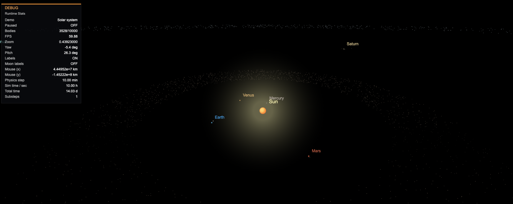

# Orbit simulator

A canvas based application that simulates real orbital mechanics using Verlet integration and the Barnes-Hut algorithm.



## About the engine

The simulation stores bodies in physical units: kilometers, kilograms, and km/s. The built-in Solar System scenario uses real planetary masses, radii, orbit distances, asteroid and Kuiper belts, and named comets, then compresses rendering scale so the whole system remains visible.

Gravity is approximated with a Barnes-Hut octree instead of a full N^2 sweep, with optional SharedArrayBuffer-backed web workers splitting force calculation across bodies if the browser is cross-origin isolated. Motion uses Verlet integration, and the engine also includes simple broad-phase collision checks, impact response, and debris generation.

Rendering is canvas based, but the world is not purely flat: bodies have X/Y/Z positions and velocities, orbits can be tilted or retrograde, and the camera supports yaw, pitch, depth sorting, zoom-to-cursor, and body following. Besides the real Solar System, the app also has scenarios with a triple-star system, procedural systems, and a procedural galaxy with hundreds of generated systems around a supermassive black hole.

# How to run

## Prerequisites

- Node.js installed

## Install dependencies

```
npm install
```

## Run

```
npm start
```

Now open the browser at http://localhost:1234

# App demo

A desktop live version of the app (with no web workers support) can be found at this [link](https://samdalvai.github.io/orbit-simulator.js/)
